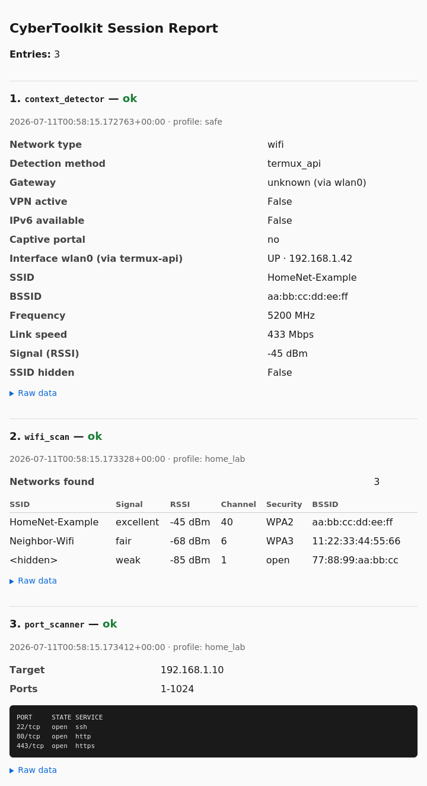

# CyberToolkit Mobile Framework


Utilitaire open source pour Android + Termux qui transforme un smartphone
en plateforme mobile d'analyse réseau et cybersécurité —
**exclusivement sur des réseaux pour lesquels l'opérateur dispose d'une
autorisation**.

Fonctionne sur Termux, avec ou sans root (certaines fonctionnalités
avancées, comme `host_discovery`, nécessitent un accès root ou un
environnement Linux standard — voir les `SPEC.md` de chaque module pour
le détail des limitations plateforme).

Licence : [MIT](LICENSE).

<p align="center">
  
</p>

<p align="center"><em>Rapport HTML généré automatiquement en fin de session — données d'exemple, aucune donnée réelle n'est jamais versionnée dans ce dépôt.</em></p>

## Principe central : Engine / Execution Policy

Les modules d'analyse (l'"Engine") savent *comment* analyser un réseau. Un
composant séparé, l'Execution Policy, décide *si* une action donnée est
autorisée en fonction d'un profil actif (`safe` par défaut) et de scopes
explicitement confirmés. Voir `docs/ARCHITECTURE.md` et
`docs/adr/ADR-0001-engine-policy-separation.md` pour le détail.

Concrètement : la détection passive de contexte réseau (interfaces, type
de réseau probable, VPN actif...) fonctionne partout, y compris sur un
Wi-Fi public, sans rien à configurer. Tout ce qui envoie des paquets à un
autre hôte (scan de ports, etc.) est refusé par défaut et ne s'active que
sur un réseau explicitement reconnu comme possédé ou autorisé par
l'opérateur.

## Installation (Termux)

```bash
# Si c'est la première utilisation de Termux, choisis un mirroir de
# paquets (évite l'avertissement "No mirror or mirror group selected")
termux-change-repo

pkg update -y
pkg install python iproute2 nmap curl jq git termux-api

# Nécessaire pour que le module reporting puisse copier des fichiers
# vers un dossier accessible par les autres apps Android, et pour que
# certaines commandes Termux:API fonctionnent correctement
termux-setup-storage

git clone https://github.com/roy1899/cybertoolkit-mobile-framework.git
cd cybertoolkit-mobile-framework
pip install -r requirements.txt
```

**Termux:API nécessite aussi une app Android séparée**, en plus du
paquet `pkg install termux-api` : installe **Termux:API** depuis
[F-Droid](https://f-droid.org/packages/com.termux.api/) (pas le Play
Store, la version Termux qui y est publiée n'est plus maintenue). Sans
cette app, les commandes `termux-*` échouent silencieusement.

## Usage

```bash
# Détection de contexte, toujours sûre (profil par défaut : safe)
python3 cli/ctk.py run context_detector

# Lister les modules disponibles
python3 cli/ctk.py list-modules

# Scan actif sur son propre réseau domestique
python3 cli/ctk.py --profile home_lab run port_scanner --target 192.168.1.10

# Inventaire des réseaux Wi-Fi visibles (signal, canal, sécurité annoncée)
# Nécessite passive_observe : pas disponible sous le profil safe
python3 cli/ctk.py --profile home_lab run wifi_scan

# Vérifier l'isolation clients d'un Wi-Fi (cache ARP local, aucune sonde émise)
python3 cli/ctk.py --profile home_lab run host_discovery

# Scan actif en mission cliente : autorisation explicite requise
python3 cli/ctk.py --profile authorized_client --authorize 203.0.113.0/24 \
    run port_scanner --target 203.0.113.10

# Chaque `run` est journalisé automatiquement (session log local)
python3 cli/ctk.py session path
python3 cli/ctk.py session clear

# Agréger la session en cours en un rapport
python3 cli/ctk.py run reporting --output report.md
python3 cli/ctk.py run reporting --output report.html

# Sans --output : génère automatiquement un .html nommé d'après le réseau
# détecté (ex: cybertoolkit_report_HomeNet_20260710_1200.html)
python3 cli/ctk.py run reporting
```

### Démonstration client (méthodologie white-hat)

Pour démontrer concrètement à un client potentiel ce qu'un attaquant
pourrait voir sur son réseau Wi-Fi, **sans jamais scanner l'appareil d'un
tiers non consentant** : utilise ton propre second appareil comme "cible"
explicitement autorisée. C'est la pratique standard du pentest — le
périmètre d'autorisation d'un client couvre son infrastructure, jamais les
appareils des autres usagers présents sur le réseau.

```bash
# 1. Connecte ton second appareil (téléphone perso, etc.) au Wi-Fi testé,
#    note son IP locale (ex: 192.168.1.50)

# 2. Vérifie d'abord passivement si l'isolation clients est déjà cassée
#    (aucune sonde émise, juste une lecture du cache ARP local)
python3 cli/ctk.py --profile authorized_client --authorize 192.168.1.50 \
    run host_discovery

# 3. Démonstration active, limitée explicitement à ton propre appareil
python3 cli/ctk.py --profile authorized_client --authorize 192.168.1.50 \
    run port_scanner --target 192.168.1.50

# 4. Génère le rapport à montrer au client
python3 cli/ctk.py run reporting
```

Le `--authorize` n'ouvre l'accès actif qu'à l'IP précisée — aucune autre
cible n'est possible dans cette session sans une nouvelle confirmation
explicite (voir `docs/adr/ADR-0002-active-probe-scope-enforcement.md`).

## Tests

```bash
pip install -r requirements.txt
python3 -m pytest
```

## Dépannage

Problèmes réellement rencontrés en développant ce projet sur appareil
réel, avec leur solution.

**`No mirror or mirror group selected`** au premier `pkg install` :
```bash
termux-change-repo
```
puis choisis n'importe quel mirroir dans la liste proposée.

**`context_detector` ou `host_discovery` retournent des champs vides ou
`"unknown"`, même avec `iproute2` installé** : c'est attendu sur la
plupart des Android non-rootés — le noyau bloque l'accès direct
(`netlink`) aux commandes réseau pour les apps non privilégiées.
`context_detector` a un repli automatique via Termux:API (voir plus
bas) ; `host_discovery` n'en a pas et le dit explicitement dans le champ
`note` de sa réponse. Voir `docs/adr/ADR-0001-engine-policy-separation.md`
et les `SPEC.md` des modules concernés pour le détail.

**`wifi_scan` retourne une erreur mentionnant la localisation** : Android
exige que le service de localisation soit activé pour renvoyer la liste
des réseaux Wi-Fi visibles (restriction du système, pas du framework).
Active la localisation dans les paramètres Android, puis réessaie.

**Les commandes `termux-*` ne renvoient rien ou échouent silencieusement**
: vérifie que l'app **Termux:API** (pas juste le paquet) est bien
installée depuis F-Droid, et qu'elle a les permissions nécessaires
(localisation notamment) dans les paramètres Android de l'app.

**`ctk run <module>` renvoie `"status": "denied"`** : c'est le
comportement attendu si tu n'as pas précisé de profil (le profil `safe`
par défaut ne permet aucune action active), ou si la cible n'est pas
dans le scope autorisé du profil choisi. Voir la table des profils dans
`docs/ARCHITECTURE.md`. Pour confirmer une cible ponctuelle :
```bash
ctk --profile authorized_client --authorize <cible> run <module> --target <cible>
```

**Tu veux faire tourner un outil sans binaire natif Android (ex: Claude
Code) en Termux** : voir `docs/TERMUX_DEV_ENVIRONMENT.md`, qui documente
la mise en place d'un environnement Ubuntu complet via `proot-distro` et
les pièges rencontrés en pratique.

## Documentation

- `docs/ARCHITECTURE.md` — vue d'ensemble technique
- `docs/TERMUX_DEV_ENVIRONMENT.md` — familles de commandes Termux et
  procédure pour un environnement Linux complet (Ubuntu via proot-distro),
  utile si tu veux faire tourner des outils sans binaire natif Android
  (ex: Claude Code)
- `docs/adr/` — décisions d'architecture (ADR)
- `docs/AUDIT_INITIAL.md` — audit du démarrage de projet
- `BACKLOG.md`, `ROADMAP.md`, `PROJECT_STATUS.md`, `CHANGELOG.md` — suivi
  de projet

## Usage responsable

Ce framework est un outil professionnel. N'exécutez de capacité active
(`active_probe`) que sur des réseaux que vous possédez ou pour lesquels
vous disposez d'une autorisation explicite et documentée. Le profil
`safe`, actif par défaut, ne réalise aucune action pouvant sortir de ce
cadre.

## Confidentialité du dépôt

Aucune donnée issue d'un scan réel (adresse MAC, IP, nom de réseau,
rapport généré) n'est versionnée dans ce dépôt — voir `.gitignore`. Les
exemples présents dans le code et la documentation utilisent des valeurs
fictives.

## Feuille de route

Voir `ROADMAP.md` et `BACKLOG.md` pour les évolutions prévues, y compris
une interface graphique envisagée pour une version ultérieure.

## Licence

[MIT](LICENSE) — libre d'utilisation, de modification et de
redistribution, y compris à des fins commerciales, à condition de
conserver la notice de copyright.
