# Environnement de développement Termux

Ce document couvre deux choses distinctes :
1. Une vue d'ensemble des familles de commandes utilisées pour travailler
   sur ce projet depuis Termux.
2. La procédure pour obtenir un environnement Linux complet (Ubuntu via
   `proot-distro`) sur Android, nécessaire si tu veux faire tourner des
   outils qui n'ont pas de binaire natif Android ARM64 (ex: Claude Code).

## Vue d'ensemble des familles de commandes

```mermaid
graph TD
    ROOT[Environnement Termux]

    ROOT --> SETUP[Installation]
    SETUP --> S1["pkg update / upgrade"]
    SETUP --> S2["termux-setup-storage"]
    SETUP --> S3["pkg install python iproute2 nmap curl jq git termux-api"]

    ROOT --> CLI[CLI du framework]
    CLI --> C1["ctk.py run &lt;module&gt;"]
    CLI --> C2["ctk.py session path / clear"]
    CLI --> C3["ctk.py list-modules"]
    CLI --> C4["ctk.py run reporting --output"]

    ROOT --> GIT[Git]
    GIT --> G1["config user.name / user.email"]
    GIT --> G2["remote add / set-url / push"]
    GIT --> G3["status / add / commit / log"]

    ROOT --> TAPI["Termux:API"]
    TAPI --> T1["termux-wifi-connectioninfo"]
    TAPI --> T2["termux-wifi-scaninfo"]
    TAPI --> T3["termux-telephony-cellinfo"]
    TAPI --> T4["termux-media-scan"]

    ROOT --> LINUX["Environnement Linux complet"]
    LINUX --> L1["proot-distro install ubuntu"]
    LINUX --> L2["PROOT_NO_SECCOMP=1 proot-distro login"]
    LINUX --> L3["Node.js + npm dans Ubuntu"]

    style ROOT fill:#1a1a1a,color:#fff
    style SETUP fill:#2d3748,color:#fff
    style CLI fill:#2d3748,color:#fff
    style GIT fill:#2d3748,color:#fff
    style TAPI fill:#2d3748,color:#fff
    style LINUX fill:#2d3748,color:#fff
```



Le détail de chaque famille (options, cas d'usage) est dans les
`SPEC.md` de chaque module pour la partie CLI, et dans le README pour
l'installation standard. Ce document se concentre sur la partie la
moins évidente : obtenir un environnement Linux complet.

## Pourquoi un environnement Linux complet ?

Certains outils n'ont pas de binaire natif pour `linux-arm64-android`
(la plateforme que Termux expose), alors qu'ils en ont un pour
`linux-arm64` standard (glibc). C'est le cas de Claude Code par exemple —
tenter `npm install -g @anthropic-ai/claude-code` en Termux natif échoue
avec :

```
Native binaries for linux-arm64-android are not available on this release channel.
  Available: darwin-arm64, darwin-x64, linux-x64, linux-arm64, linux-x64-musl, linux-arm64-musl, win32-x64, win32-arm64
```

`proot-distro` permet de faire tourner une vraie distribution Linux
(Ubuntu ici) à l'intérieur de Termux, avec un `linux-arm64` glibc
standard — ce qui résout ce type de problème sans root.

## Installation d'Ubuntu via proot-distro

```bash
pkg install proot-distro
proot-distro install ubuntu
```

### Piège n°1 : erreur "Invalid argument" sur les gros binaires

Une fois connecté (`proot-distro login ubuntu`), certaines opérations
sur de gros fichiers (comme le binaire de Claude Code, ~250 Mo) échouent
avec :

```
ls: unknown io error: '...', 'Os { code: 22, kind: InvalidInput, message: "Invalid argument" }'
```

C'est une limitation connue de l'émulation seccomp de `proot` sur
Android. Solution : désactiver cette émulation au login.

```bash
PROOT_NO_SECCOMP=1 proot-distro login ubuntu
```

### Piège n°2 : Ubuntu ne voit pas les fichiers Termux

Par défaut, l'environnement `proot-distro` est isolé du système de
fichiers Termux natif — ton dépôt cloné en Termux (`~/CyberToolkit`)
n'est pas visible depuis Ubuntu. Pour partager le dossier home Termux :

```bash
PROOT_NO_SECCOMP=1 proot-distro login ubuntu --bind /data/data/com.termux/files/home:/root/termux-home
```

Le dépôt est alors accessible dans Ubuntu à `/root/termux-home/CyberToolkit`.

### Piège n°3 : le `npm` fourni par `apt` est cassé

`apt install nodejs npm` sur Ubuntu (via `proot-distro`) installe une
version de npm reconditionnée en centaines de paquets `.deb` fragmentés
(`node-glob`, `node-tapable`, etc.), souvent incomplète ou incohérente.
Symptôme typique :

```
Error: Cannot find module '/usr/share/node_modules/glob/dist/cjs/src/index.js'
```

**Solution recommandée** : installer Node.js directement depuis
NodeSource plutôt que via les dépôts Ubuntu génériques :

```bash
curl -fsSL https://deb.nodesource.com/setup_lts.x | bash -
apt install -y nodejs
node --version
npm --version
```

### Installer un outil ayant besoin d'un binaire natif (exemple : Claude Code)

```bash
npm install -g @anthropic-ai/claude-code
claude --version
```

Si l'installation échoue avec `npm warn allow-scripts` (npm 11+ bloque
les scripts post-install par défaut) :

```bash
npm install -g --allow-scripts=@anthropic-ai/claude-code @anthropic-ai/claude-code
```

## Limitation connue : pas d'accès réseau natif complet

`proot-distro` traduit les appels système mais n'a pas d'accès direct à
l'interface réseau physique du téléphone. Concrètement, des commandes
comme `ip neigh show` s'exécutent sans erreur de permission (contrairement
à Termux natif, où elles sont bloquées par SELinux Android), mais ne
retournent aucune donnée exploitable car l'environnement n'a pas de
route de sortie réelle vers le réseau Wi-Fi/cellulaire.

**Conséquence pratique pour ce projet** : `proot-distro` est utile pour
faire tourner des outils de développement (Node.js, compilateurs, Claude
Code...), mais **pas** comme solution de contournement pour les
limitations réseau documentées dans `engine/modules/host_discovery/SPEC.md`
et `engine/modules/context_detector/module.py` (accès netlink bloqué sur
Android non-rooté). Les modules du framework doivent continuer à tourner
en Termux natif pour un accès réseau représentatif de l'usage réel.
